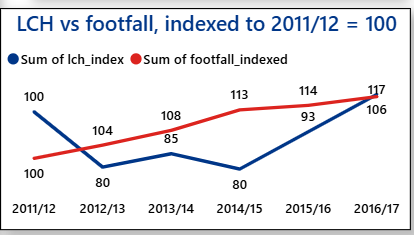
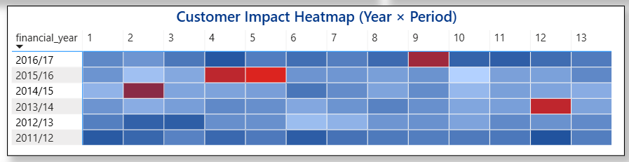

# London Underground Reliability and Station Demand Analysis

## Project Overview

A data analysis project looking at whether London Underground's reliability kept pace with growing passenger demand between 2011 and 2017. Built for a portfolio piece using real Transport for London open data, working through the full pipeline, raw data, cleaning, SQL analysis, Power BI visuals, and a five page interactive dashboard.

The project covers two datasets, reliability measured in Lost Customer Hours across 2011 to 2017, and station footfall for 268 stations across the same period, split by weekday, Saturday and Sunday, with borough information included from 2011 onward.

The core question: did growing passenger demand outpace the network's reliability? Put simply, demand grew every year, but reliability did not keep pace.

---

## Insights

#### Datasets

- Raw datasets can be found in the `Raw` folder
- Cleaned datasets, clean_lost_customer_hours.csv and clean_station_footfall.csv, can also be found in the `cleaned files` folder

#### Data Cleaning and Analysis

- The full Python cleaning work for the reliability data is in [london_underground_lost_customer_hours_preprocessing.ipynb](london_underground_lost_customer_hours_preprocessing.ipynb)
- The full Python cleaning work for the station footfall data is in [london_underground_station_footfall.ipynb](london_underground_station_footfall.ipynb)
- The SQL queries used to analyse reliability trends are in [lost_customer_hours_sql.sql](lost_customer_hours_sql.sql)
- The SQL queries used to analyse station demand, and combine it with reliability, are in [clean_station_footfall_sql.sql](clean_station_footfall_sql.sql)
- The finished five page Power BI report can be found in this repository as a pbix file

---

## Tools and Technologies

| Category | Tools |
|-----------|--------|
| Programming and cleaning | Python (Pandas), Jupyter Notebook |
| Database management | MySQL |
| Visualisation and dashboard | Power BI, including ArcGIS Maps for Power BI |
| Data storage | CSV and Excel files |
| Version control | GitHub |

---

## Project Phases

---

### Phase 1: Data Cleaning (Python and Pandas)

Before any analysis, both raw files needed a proper look. Neither file was pre cleaned, both were real world government exports with messy structure.

---

#### Reliability data: london_underground_lost_customer_hours_preprocessing.ipynb

**What the raw data looked like**

The Lost Customer Hours sheet was loaded directly from tfl tube performance.xlsx. It came in wide format, one row per financial year, with thirteen separate period columns, and numbers stored as text with commas in them.


**Cleaning column names**

Column names were stripped, lowercased, and had spaces replaced, to avoid problems later in SQL and Power BI.


**Converting numbers stored as text**

Each period column had commas in the numbers, so every column except financial_year was converted using pandas to_numeric, with errors coerced to catch anything unexpected.


**Filtering to the correct years**

The data was filtered down to 2011/12 through 2016/17, to match the years available in the footfall dataset.


**Reshaping from wide to long format**

The sheet originally had one row per year and thirteen period columns. This is not a usable shape for SQL or Power BI, so pandas melt was used to reshape it into one row per year and period.


**Cleaning the period column**

The period column had text like period_1 in it, which was stripped down and converted into a plain number.


**Sorting and final check**

The data was sorted by year and period, to make sure it was in the correct time order before export.


**Quick exploratory charts**

A few charts were built at this stage purely to sense check the data, a trend line of total Lost Customer Hours per year, a bar chart by period, and a heatmap of year against period.


**Exporting the cleaned file**

The cleaned, reshaped dataset was exported as clean_lost_customer_hours.csv, ready for MySQL.


---

#### Footfall data: london_underground_station_footfall.ipynb

**Loading the legacy file format**

The footfall file is in the older xls format, so the xlrd engine was installed and used to read it.


**Finding the real header row**

Each yearly sheet had several junk rows at the top before the actual header, so the raw sheet was inspected first with no header assumed, to find exactly where the real data started.


**Skipping the junk rows**

Once the correct row was confirmed, the sheet was reloaded skipping the first six rows.


**Renaming columns clearly**

Columns were renamed to plain, unambiguous names, station, borough, entry and exit figures for weekday, Saturday and Sunday, and the annual total.


**Handling inconsistent columns across years**

Earlier years, 2011 to 2013, had ten columns, since they did not include borough information. Later years, 2014 onward, had eleven columns. This was handled with a column count check inside a loop that processed all seven years at once.


**Removing blank and summary rows**

Rows with a missing station code were removed first, since these were blank rows or leftover summary rows from the original spreadsheet.


**A second safety filter**

A small number of rows still had a missing station name even after that first filter, so a second filter was added directly on the station column.


**Converting numeric columns properly**

All entry and exit columns were converted to numeric values, with errors coerced, to catch anything that had slipped through as text.


**Building derived columns**

Two new columns were created, total_weekday and total_weekend, by combining entries and exits for each.


**Exporting the cleaned file**

The final combined dataset, covering all seven years, was exported as clean_station_footfall.csv.


---

### Phase 2: Exploratory Data Analysis (SQL)

Both cleaned CSV files were imported into MySQL. Each query below is written to answer a specific business question a consolidator or operator would actually ask.

---

**Business question: Which stations get the most use overall?**

```sql
SELECT station,
       SUM(annual_entry_exit_million) AS total_footfall_million
FROM clean_station_footfall
GROUP BY station
ORDER BY total_footfall_million DESC
LIMIT 10;
```


Waterloo comes out on top, with King's Cross St Pancras and Oxford Circus close behind. These are the stations where any reliability problem would affect the largest number of people.

---

**Business question: Which stations are growing or declining the fastest?**

```sql
SELECT f2011.station,
       f2011.annual_entry_exit_million AS footfall_2011,
       f2017.annual_entry_exit_million AS footfall_2017,
       ROUND(
           (f2017.annual_entry_exit_million - f2011.annual_entry_exit_million)
           / f2011.annual_entry_exit_million * 100, 2
       ) AS pct_growth
FROM clean_station_footfall f2011
JOIN clean_station_footfall f2017
     ON TRIM(f2011.station) = TRIM(f2017.station)
WHERE f2011.year = 2011 AND f2017.year = 2017
AND f2011.annual_entry_exit_million > 0
ORDER BY pct_growth DESC
LIMIT 10;
```


This uses a self join, comparing the same station across two different years within a single row, since a normal WHERE clause cannot ask for two different years from the same row at once. One station, Blackfriars, had to be filtered out of the growth calculation, since it briefly had zero footfall due to redevelopment, which made percentage growth undefined. Cannon Street came out as the fastest growing station, while Walthamstow Central showed the sharpest decline.

A separate trailing whitespace issue in the station names silently broke this join at first, returning zero rows with no error, until TRIM was added to the join condition.

---

**Business question: How does weekday use compare with weekend use, station by station?**

```sql
SELECT station,
       year,
       total_weekday,
       total_weekend,
       ROUND(total_weekday / total_weekend, 2) AS weekday_weekend_ratio
FROM clean_station_footfall
WHERE year = 2017
ORDER BY weekday_weekend_ratio DESC
LIMIT 10;
```


Moorgate has the highest ratio, at over four times more weekday use than weekend use, followed by several other City of London financial district stations. These stations empty out sharply at weekends, which makes intuitive sense given the office heavy area they sit in.

---

**Business question: How is footfall distributed across boroughs, and how has that changed over time?**

```sql
SELECT borough,
       year,
       SUM(annual_entry_exit_million) AS total_footfall
FROM clean_station_footfall
WHERE borough IS NOT NULL AND borough != ''
GROUP BY borough, year
ORDER BY borough, year;
```


This gives a full borough by borough breakdown across the years, used as the basis for the borough growth comparison below.

---

**Business question: Which boroughs grew the fastest between 2014 and 2017?**

```sql
SELECT b2014.borough,
       b2014.total_footfall AS footfall_2014,
       b2017.total_footfall AS footfall_2017,
       ROUND(
           (b2017.total_footfall - b2014.total_footfall) / b2014.total_footfall * 100, 2
       ) AS pct_growth
FROM (
    SELECT borough, SUM(annual_entry_exit_million) AS total_footfall
    FROM clean_station_footfall
    WHERE year = 2014 AND borough IS NOT NULL AND borough != ''
    GROUP BY borough
) b2014
JOIN (
    SELECT borough, SUM(annual_entry_exit_million) AS total_footfall
    FROM clean_station_footfall
    WHERE year = 2017 AND borough IS NOT NULL AND borough != ''
    GROUP BY borough
) b2017
ON b2014.borough = b2017.borough
ORDER BY pct_growth DESC;
```


This needed two smaller subqueries joined together, rather than a direct self join, since a borough's total first needs its own grouping step, as a borough contains many stations, before two years can be properly compared.

---

**Business question: What is the total Lost Customer Hours figure for each financial year?**

```sql
SELECT financial_year,
       SUM(lost_customer_hours) AS total_lch
FROM clean_lost_customer_hours
GROUP BY financial_year
ORDER BY financial_year;
```


This is the headline reliability figure behind the whole project, showing how Lost Customer Hours moved year by year across the whole period.

---

**Business question: How much did reliability change from one year to the next?**

```sql
WITH yearly AS (
    SELECT financial_year,
           SUM(lost_customer_hours) AS total_lch
    FROM clean_lost_customer_hours
    GROUP BY financial_year
)
SELECT financial_year,
       total_lch,
       LAG(total_lch) OVER (ORDER BY financial_year) AS prev_year,
       ROUND(
           (total_lch - LAG(total_lch) OVER (ORDER BY financial_year))
           / LAG(total_lch) OVER (ORDER BY financial_year) * 100, 2
       ) AS yoy_change
FROM yearly;
```


This uses a window function to compare each year against the one before it, without needing a self join. It shows reliability actually improving for several years before reversing sharply in the final year.

---

**Business question: Which operational periods are consistently the worst for reliability?**

```sql
SELECT period,
       SUM(lost_customer_hours) AS total_lch
FROM clean_lost_customer_hours
GROUP BY period
ORDER BY total_lch DESC;
```


This flags which of the thirteen operational periods, taken across all years, carry the most lost customer hours in total, useful for spotting a recurring seasonal or operational pattern rather than a one off event.

---

**Business question: Which was the best year and which was the worst, for reliability?**

```sql
SELECT financial_year, SUM(lost_customer_hours) AS total_lch
FROM clean_lost_customer_hours
GROUP BY financial_year
ORDER BY total_lch ASC;
```


2014/15 comes out as the best year, with the lowest total Lost Customer Hours, while 2016/17 is clearly the worst, a six year high.

---

**Business question: Does higher footfall actually go together with worse reliability?**

```sql
SELECT lch.financial_year,
       lch.total_lch,
       ff.total_footfall
FROM (
    SELECT financial_year, SUM(lost_customer_hours) AS total_lch
    FROM clean_lost_customer_hours
    GROUP BY financial_year
) lch
JOIN (
    SELECT year, SUM(annual_entry_exit_million) AS total_footfall
    FROM clean_station_footfall
    GROUP BY year
) ff
ON LEFT(lch.financial_year, 4) = ff.year
ORDER BY lch.financial_year;
```


This is the query that ties the whole project together. It joins a financial year format like 2014/15 against a plain calendar year like 2014, which is a known and reasonable approximation, since the two datasets use different year formats and financial years do not map exactly onto calendar years. The result shows footfall growing every single year, while reliability actually improved for a few years before reversing sharply, ending at a six year worst in 2016/17.

---

### Phase 3: Advanced Analysis and Visual Design (Power BI)

Moved into Power BI for the visual and interactive work. All screenshots are in the `images` folder.

---

**Indexed comparison of demand and reliability**



Since footfall is measured in people and Lost Customer Hours is measured in hours, the two cannot sit on the same chart scale directly. Both were indexed to a common base of 100 at 2011/12, which is a standard analyst technique that allows two completely different units to be compared visually on one chart.

---

**Reliability trends page**



Yearly Lost Customer Hours, a heatmap of year against operational period, and a chart of the worst periods across all years.

---

**Station demand page**


The busiest stations, the fastest growing and declining stations, weekday versus weekend ratios, and borough level totals.

---

**Building a proper date table**

Transport for London uses a non standard financial calendar, with thirteen periods of twenty eight days each, rather than normal calendar months. A calculated date table was built to support real time intelligence functions properly, rather than relying on manual year on year formulas.


---

**A relationship bug worth documenting**

Once the date table was linked, a year on year measure returned the same, incorrect total for every single year. The cause was the relationship's cross filter direction being set to Single, which only lets filters flow one way. Changing it to Both fixed the measure completely.


---

**Sourcing real station coordinates**

Neither raw file included station coordinates, so these were sourced separately from a Transport for London Freedom of Information response, released with no copyright restrictions, and joined onto the station table by name.


---

**Sourcing real station photographs**

A manual search for photographs across more than two hundred and fifty stations was not practical, so a small Python script, fetch_station_images.py, was built to query Wikipedia's public API directly and return a real photograph and source link for every station.


---

**Building the interactive station map**

Real coordinates and photographs were joined onto the station data, and a working map was built using ArcGIS Maps for Power BI, with station photographs shown directly in the tooltip.


---

**An interactive line explorer**

A clickable set of coloured buttons, matching the real colours used across the London Underground network, was built using bookmarks, since conditional colour formatting was not available for every visual in this version of Power BI. Clicking a line filters the map and a footfall chart down to just that line's stations.


---

**Plotting footfall along a single line, in the correct order**

A station to line sequence table was built to plot footfall along a selected line in proper geographic order, from one end of the line to the other, rather than alphabetically. This ordering is accurate for straight lines, and only an approximation for lines that branch, since branch topology is not fully captured by geography alone, and this limitation is documented clearly rather than hidden.


---

### Phase 4: Final Dashboard (Power BI)

**Executive summary page**


Key metrics, a borough breakdown, a weekday versus weekend split, and a small version of the interactive station map, all on one page.

---

**Full five page report**


The finished report brings every phase of the project together across five pages, executive summary, reliability trends, station demand, the interactive station map, and cross analysis with recommendations.

---

**Cross analysis and recommendations page**


A scatter chart comparing footfall and Lost Customer Hours by year, with the worst year clearly flagged, sitting alongside the key stats and the recommendations below.

The report was built to answer the core business question directly, not just display the data, but make clear whether reliability kept pace with demand, and what to do about it.

---

## Key Findings

- Footfall grew every single year from 2011 to 2017
- Lost Customer Hours actually improved for several years, 2012 to 2015, before reversing sharply
- 2016/17 was a six year worst for reliability, even though 2014/15 had been the best year on record
- Waterloo is the busiest station overall, while Cannon Street is the fastest growing and Walthamstow Central the fastest declining
- City of London financial district stations, led by Moorgate, show the sharpest weekday versus weekend contrast
- The relationship between demand and reliability is not simple or linear, worse outcomes are not inevitable just because footfall grows

---

## Recommendations

1. Look into why 2016/17 got so much worse. Reliability had actually been improving for years, so something clearly changed that year, and it is worth finding out what before it happens again.
2. Focus reliability upgrades on the busiest central stations. This is where growth is concentrated, so problems here affect the most people.
3. Keep an eye on fast growing stations like Cannon Street. They are quiet now, but today's growth could mean tomorrow's overcrowding if nothing changes.

---

## A Note on Data and Images

All reliability and footfall data comes from Transport for London, released under the Open Government Licence. Station coordinates were sourced from a Transport for London Freedom of Information response, released with no copyright restrictions. Station photographs are sourced from Wikipedia and Wikimedia Commons, mostly under Creative Commons licences that require attribution to the original photographer, so please check the individual file page for the correct photographer credit before using any image publicly.

---

## What Could Be Added With More Time

- Full, verified sequence order for every line, rather than a geographic approximation for lines that branch
- A more complete set of station photographs with individually confirmed licences
- Further recommendations tying station level reliability data to demand, if that data becomes available at station level in future

---

## Acknowledgements

All data is sourced from Transport for London under the Open Government Licence, with supporting open data used for station coordinates and line information. All analysis, cleaning and visualisation work is my own.

---

## Contact

**Your name here**

Data Analyst | SQL, Python, Power BI

London, UK

Add your email, LinkedIn and phone badges here, in the same style as your other project, once you are ready to publish.
