# London Underground Reliability and Station Demand Analysis

## Project Overview

A data analysis project looking at whether London Underground's reliability kept pace with growing passenger demand between 2011 and 2017. Built for a portfolio piece using real Transport for London open data, working through the full pipeline, raw data, cleaning, SQL analysis, Power BI visuals, and a five page interactive dashboard.

The project covers two datasets, reliability measured in Lost Customer Hours across 2011 to 2017, and station footfall for 268 stations across the same period, split by weekday, Saturday and Sunday, with borough information included from 2011 onward.

The core question: did growing passenger demand outpace the network's reliability? Put simply, demand grew every year, but reliability did not keep pace.

---

## Insights

#### Datasets

- Raw datasets can be found in the `Raw` folder
- Cleaned datasets, clean_lost_customer_hours.csv and clean_station_footfall.csv, can also be found in the `cleaned files` folder

#### Data Cleaning and Analysis

- The full Python cleaning work for the reliability data is in [london_underground_lost_customer_hours_preprocessing.ipynb](Python/london_underground_lost_customer_hours_preprocessing.ipynb)
- The full Python cleaning work for the station footfall data is in [london_underground_station_footfall.ipynb](Python/london_underground_station_footfall.ipynb)
- The SQL queries used to analyse reliability trends are in [lost_customer_hours_sql.sql](SQL/lost_customer_hours_sql.sql)
- The SQL queries used to analyse station demand, and combine it with reliability, are in [clean_station_footfall_sql.sql](SQL/clean_station_footfall_sql.sql)
- The finished five page Power BI report can be found in this repository as a pbix file

---

## Tools and Technologies

| Category | Tools |
|-----------|--------|
| Programming and cleaning | Python (Pandas),(Matplotlib), Jupyter Notebook |
| Database management | MySQL |
| Visualisation and dashboard | Power BI, including ArcGIS Maps for Power BI |
| Data storage | CSV and Excel files |
| Version control | GitHub |

---

## Project Phases

---

### Phase 1: Data Cleaning (Python and Pandas)

Before any analysis, both raw files needed a proper look. Neither file was pre cleaned, both were real world government exports with messy structure.

---

#### Reliability data: london_underground_lost_customer_hours_preprocessing.ipynb

**What the raw data looked like**

The Lost Customer Hours sheet was loaded directly from tfl tube performance.xlsx. It came in wide format, one row per financial year, with thirteen separate period columns, and numbers stored as text with commas in them.

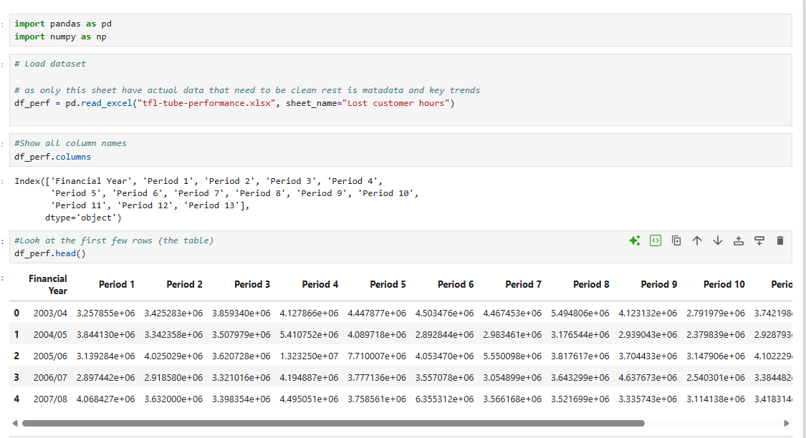

**Cleaning column names**

Column names were stripped, lowercased, and had spaces replaced, to avoid problems later in SQL and Power BI.

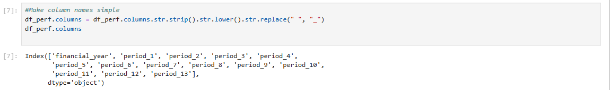

**Converting numbers stored as text**

Each period column had commas in the numbers, so every column except financial_year was converted using pandas to_numeric, with errors coerced to catch anything unexpected.

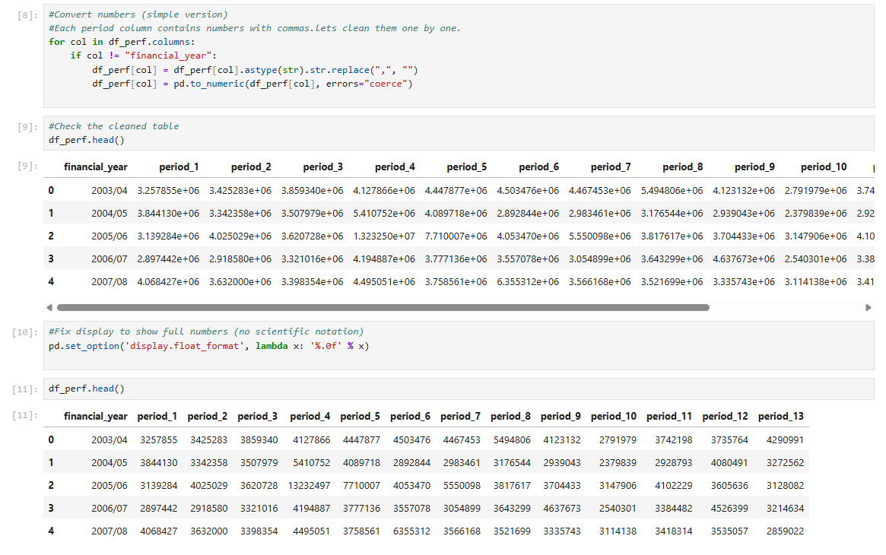

**Filtering to the correct years**

The data was filtered down to 2011/12 through 2016/17, to match the years available in the footfall dataset.

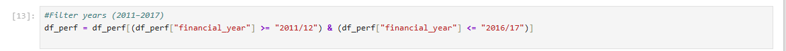

**Reshaping from wide to long format**

The sheet originally had one row per year and thirteen period columns. This is not a usable shape for SQL or Power BI, so pandas melt was used to reshape it into one row per year and period.

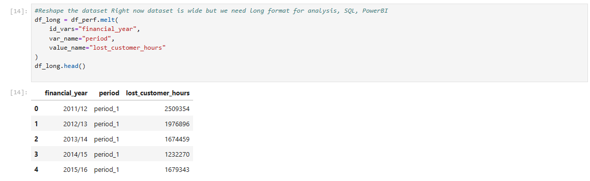

**Cleaning the period column**

The period column had text like period_1 in it, which was stripped down and converted into a plain number.

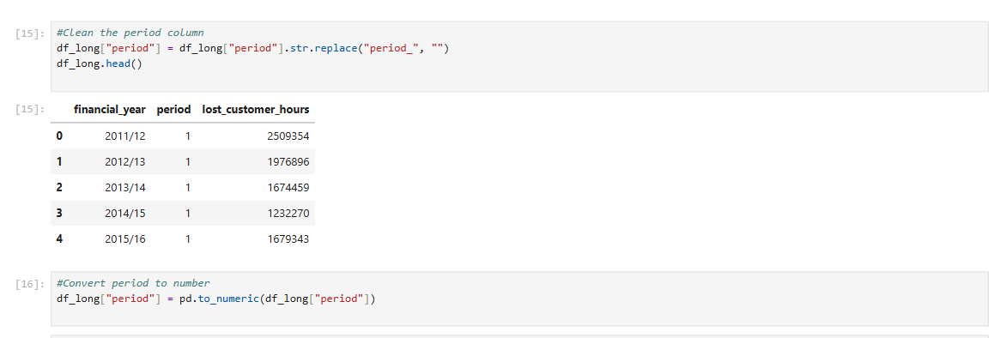

**Sorting and final check**

The data was sorted by year and period, to make sure it was in the correct time order before export.

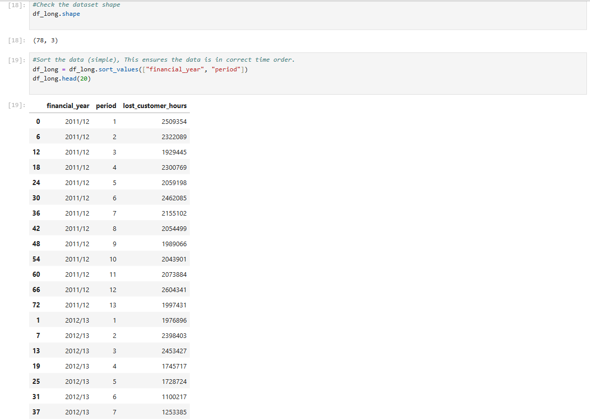

**Quick exploratory charts**

A few charts were built at this stage purely to sense check the data, a trend line of total Lost Customer Hours per year, a bar chart by period, and a heatmap of year against period.

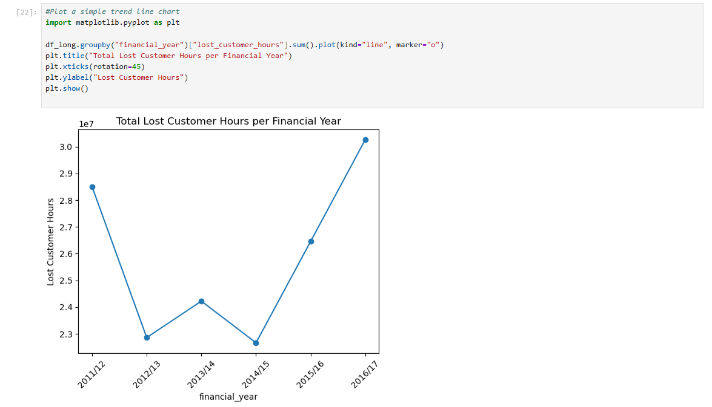
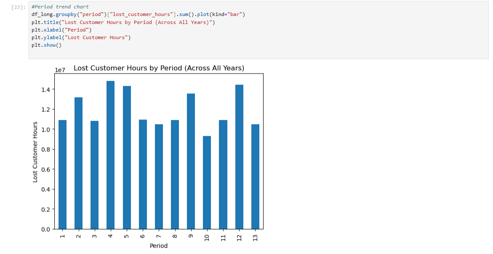
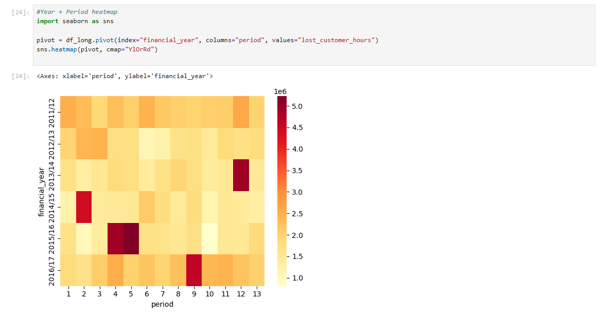

**Exporting the cleaned file**

The cleaned, reshaped dataset was exported as clean_lost_customer_hours.csv, ready for MySQL.

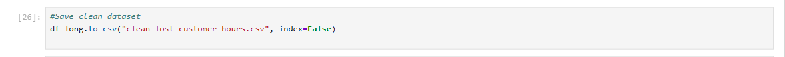

---

#### Footfall data: london_underground_station_footfall.ipynb

**Loading the legacy file format**

The footfall file is in the older xls format, so the xlrd engine was installed and used to read it.

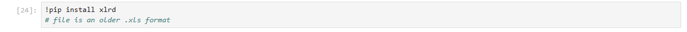

**Finding the real header row**

Each yearly sheet had several junk rows at the top before the actual header, so the raw sheet was inspected first with no header assumed, to find exactly where the real data started.

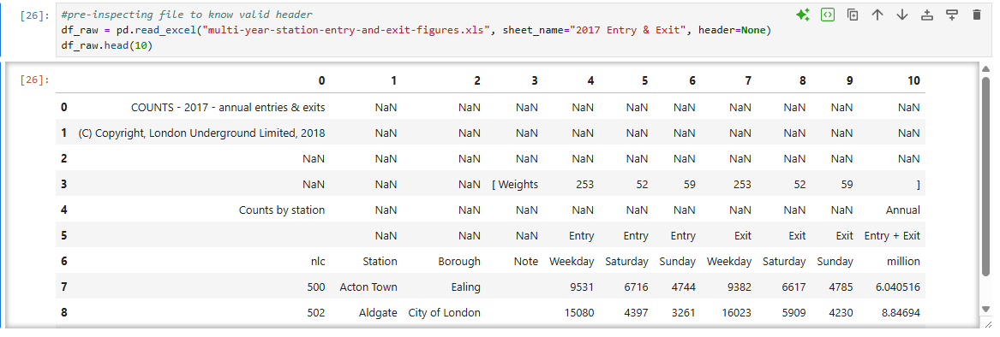

**Skipping the junk rows**

Once the correct row was confirmed, the sheet was reloaded skipping the first six rows.

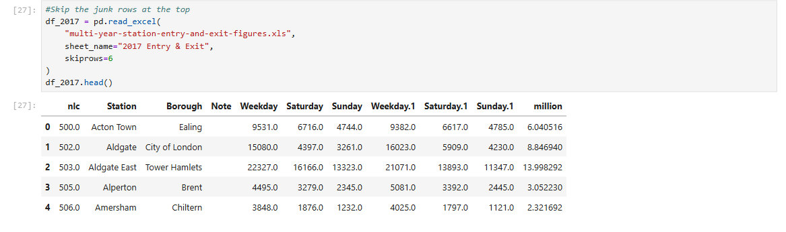

**Renaming columns clearly**

Columns were renamed to plain, unambiguous names, station, borough, entry and exit figures for weekday, Saturday and Sunday, and the annual total.

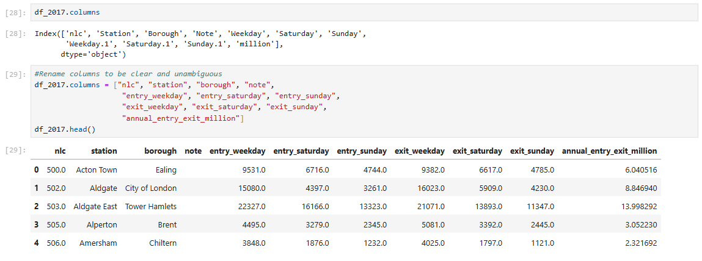

**Adding year columns across years**

For appending all years sheets in one file, year column was introduced.

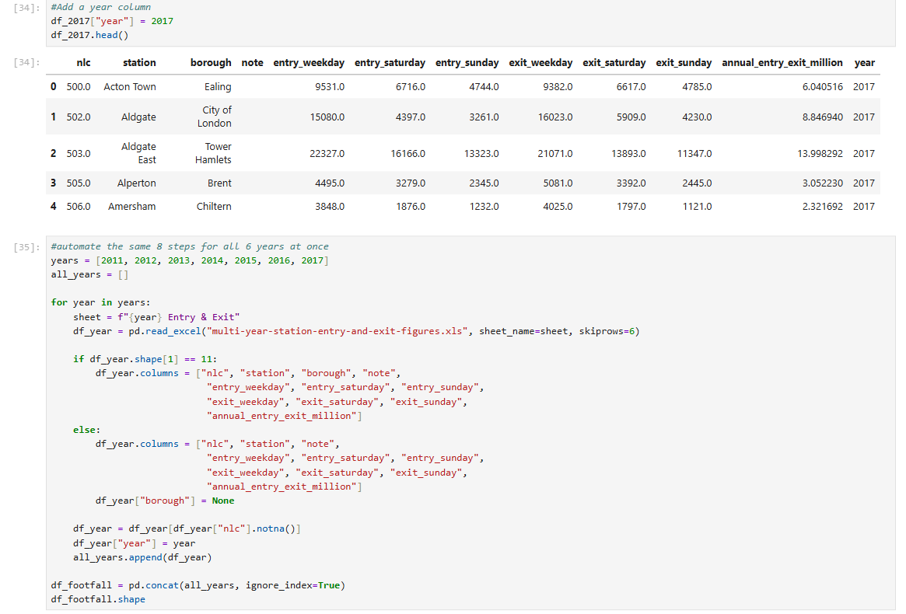

**Removing blank and summary rows**

Rows with a missing station code were removed first, since these were blank rows or leftover summary rows from the original spreadsheet.

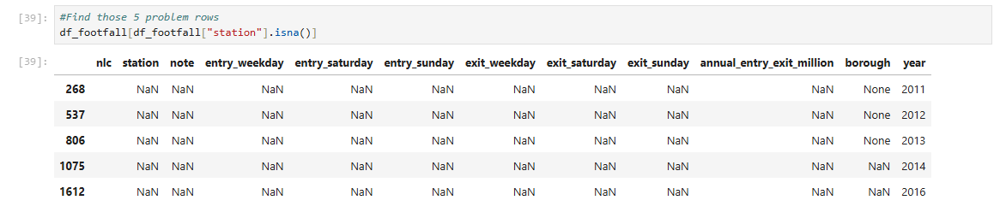

**A second safety filter**

A small number of rows still had a missing station name even after that first filter, so a second filter was added directly on the station column.

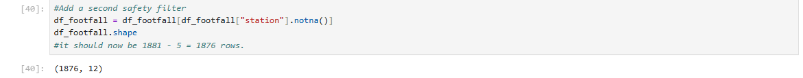

**Converting numeric columns properly**

All entry and exit columns were converted to numeric values, with errors coerced, to catch anything that had slipped through as text.

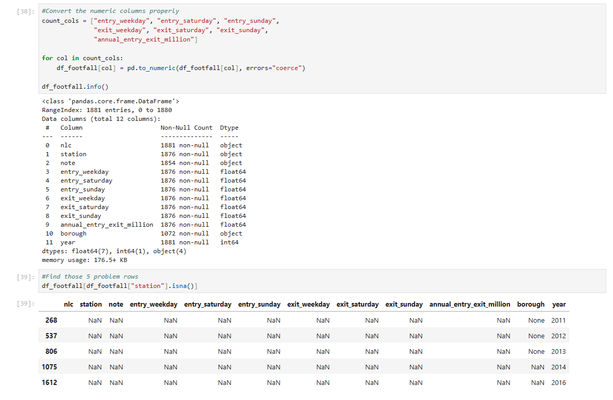

**Building derived columns**

Two new columns were created, total_weekday and total_weekend, by combining entries and exits for each.

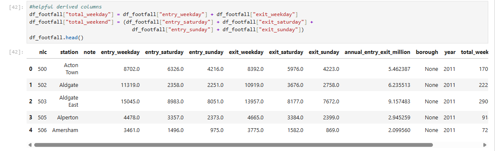

**Exporting the cleaned file**

The final combined dataset, covering all seven years, was exported as clean_station_footfall.csv.

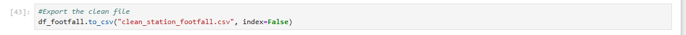

---

### Phase 2: Exploratory Data Analysis (SQL)

Both cleaned CSV files were imported into MySQL. Each query below is written to answer a specific business question a consolidator or operator would actually ask.

---

**Business question: Which stations get the most use overall?**

```sql
SELECT station,
       SUM(annual_entry_exit_million) AS total_footfall_million
FROM clean_station_footfall
GROUP BY station
ORDER BY total_footfall_million DESC
LIMIT 10;
```

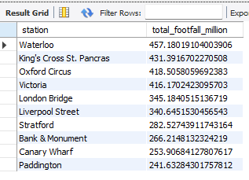

Waterloo comes out on top, with King's Cross St Pancras and Oxford Circus close behind. These are the stations where any reliability problem would affect the largest number of people.

---

**Business question: Which stations are growing or declining the fastest?**

```sql
SELECT f2011.station,
       f2011.annual_entry_exit_million AS footfall_2011,
       f2017.annual_entry_exit_million AS footfall_2017,
       ROUND(
           (f2017.annual_entry_exit_million - f2011.annual_entry_exit_million)
           / f2011.annual_entry_exit_million * 100, 2
       ) AS pct_growth
FROM clean_station_footfall f2011
JOIN clean_station_footfall f2017
     ON TRIM(f2011.station) = TRIM(f2017.station)
WHERE f2011.year = 2011 AND f2017.year = 2017
AND f2011.annual_entry_exit_million > 0
ORDER BY pct_growth DESC
LIMIT 10;
```

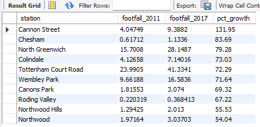

This uses a self join, comparing the same station across two different years within a single row, since a normal WHERE clause cannot ask for two different years from the same row at once. One station, Blackfriars, had to be filtered out of the growth calculation, since it briefly had zero footfall due to redevelopment, which made percentage growth undefined. Cannon Street came out as the fastest growing station, while Walthamstow Central showed the sharpest decline.

A separate trailing whitespace issue in the station names silently broke this join at first, returning zero rows with no error, until TRIM was added to the join condition.

---

**Business question: How does weekday use compare with weekend use, station by station?**

```sql
SELECT station,
       year,
       total_weekday,
       total_weekend,
       ROUND(total_weekday / total_weekend, 2) AS weekday_weekend_ratio
FROM clean_station_footfall
WHERE year = 2017
ORDER BY weekday_weekend_ratio DESC
LIMIT 10;
```

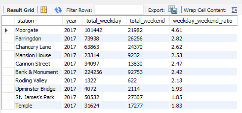

Moorgate has the highest ratio, at over four times more weekday use than weekend use, followed by several other City of London financial district stations. These stations empty out sharply at weekends, which makes intuitive sense given the office heavy area they sit in.

---

**Business question: How is footfall distributed across boroughs, and how has that changed over time?**

```sql
SELECT borough,
       year,
       SUM(annual_entry_exit_million) AS total_footfall
FROM clean_station_footfall
WHERE borough IS NOT NULL AND borough != ''
GROUP BY borough, year
ORDER BY borough, year;
```

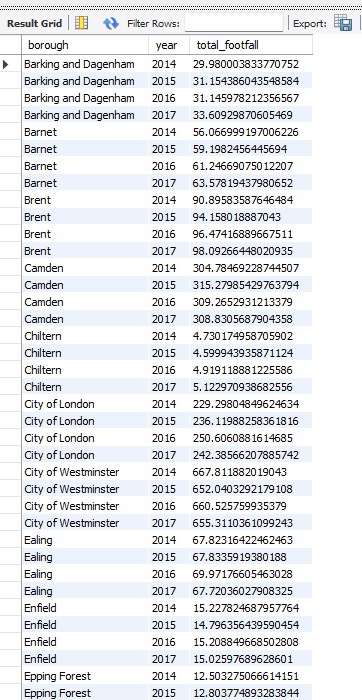

This gives a full borough by borough breakdown across the years, used as the basis for the borough growth comparison below.

---

**Business question: Which boroughs grew the fastest between 2014 and 2017?**

```sql
SELECT b2014.borough,
       b2014.total_footfall AS footfall_2014,
       b2017.total_footfall AS footfall_2017,
       ROUND(
           (b2017.total_footfall - b2014.total_footfall) / b2014.total_footfall * 100, 2
       ) AS pct_growth
FROM (
    SELECT borough, SUM(annual_entry_exit_million) AS total_footfall
    FROM clean_station_footfall
    WHERE year = 2014 AND borough IS NOT NULL AND borough != ''
    GROUP BY borough
) b2014
JOIN (
    SELECT borough, SUM(annual_entry_exit_million) AS total_footfall
    FROM clean_station_footfall
    WHERE year = 2017 AND borough IS NOT NULL AND borough != ''
    GROUP BY borough
) b2017
ON b2014.borough = b2017.borough
ORDER BY pct_growth DESC;
```

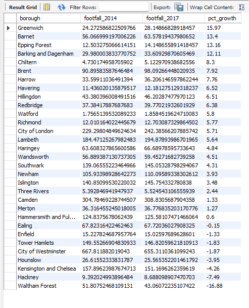

This needed two smaller subqueries joined together, rather than a direct self join, since a borough's total first needs its own grouping step, as a borough contains many stations, before two years can be properly compared.

---

**Business question: What is the total Lost Customer Hours figure for each financial year?**

```sql
SELECT financial_year,
       SUM(lost_customer_hours) AS total_lch
FROM clean_lost_customer_hours
GROUP BY financial_year
ORDER BY financial_year;
```

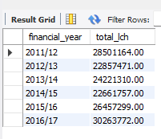

This is the headline reliability figure behind the whole project, showing how Lost Customer Hours moved year by year across the whole period.

---

**Business question: How much did reliability change from one year to the next?**

```sql
WITH yearly AS (
    SELECT financial_year,
           SUM(lost_customer_hours) AS total_lch
    FROM clean_lost_customer_hours
    GROUP BY financial_year
)
SELECT financial_year,
       total_lch,
       LAG(total_lch) OVER (ORDER BY financial_year) AS prev_year,
       ROUND(
           (total_lch - LAG(total_lch) OVER (ORDER BY financial_year))
           / LAG(total_lch) OVER (ORDER BY financial_year) * 100, 2
       ) AS yoy_change
FROM yearly;
```

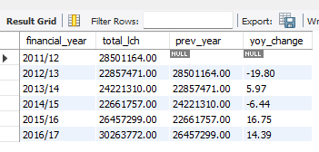

This uses a window function to compare each year against the one before it, without needing a self join. It shows reliability actually improving for several years before reversing sharply in the final year.

---

**Business question: Which operational periods are consistently the worst for reliability?**

```sql
SELECT period,
       SUM(lost_customer_hours) AS total_lch
FROM clean_lost_customer_hours
GROUP BY period
ORDER BY total_lch DESC;
```

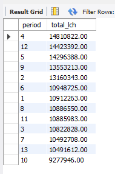

This flags which of the thirteen operational periods, taken across all years, carry the most lost customer hours in total, useful for spotting a recurring seasonal or operational pattern rather than a one off event.

---

**Business question: Which was the best year and which was the worst, for reliability?**

```sql
(SELECT financial_year, SUM(lost_customer_hours) AS total_lch, 'Best' AS label
 FROM clean_lost_customer_hours GROUP BY financial_year ORDER BY total_lch ASC LIMIT 1)
UNION
(SELECT financial_year, SUM(lost_customer_hours) AS total_lch, 'Worst' AS label
 FROM clean_lost_customer_hours GROUP BY financial_year ORDER BY total_lch DESC LIMIT 1);
```

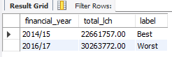

2014/15 comes out as the best year, with the lowest total Lost Customer Hours, while 2016/17 is clearly the worst, a six year high.

---

**Business question: Does higher footfall actually go together with worse reliability?**

```sql
SELECT lch.financial_year,
       lch.total_lch,
       ff.total_footfall
FROM (
    SELECT financial_year, SUM(lost_customer_hours) AS total_lch
    FROM clean_lost_customer_hours
    GROUP BY financial_year
) lch
JOIN (
    SELECT year, SUM(annual_entry_exit_million) AS total_footfall
    FROM clean_station_footfall
    GROUP BY year
) ff
ON LEFT(lch.financial_year, 4) = ff.year
ORDER BY lch.financial_year;
```

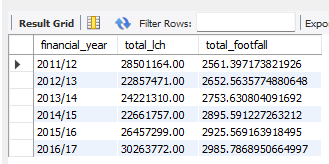

This is the query that ties the whole project together. It joins a financial year format like 2014/15 against a plain calendar year like 2014, which is a known and reasonable approximation, since the two datasets use different year formats and financial years do not map exactly onto calendar years. The result shows footfall growing every single year, while reliability actually improved for a few years before reversing sharply, ending at a six year worst in 2016/17.

---

### Phase 3: Advanced Analysis and Visual Design (Power BI)

Moved into Power BI for the visual and interactive work. All screenshots are in the `images` folder.

Each page includes slicers along the left hand side so you can filter by Underground line. The numbered circles in the top right corner of every page act as a simple page navigation guide. If you open the .pbix file in Power BI Desktop you can click through the slicers and drill into any station or year yourself.

---

## Page 1: Executive Summary

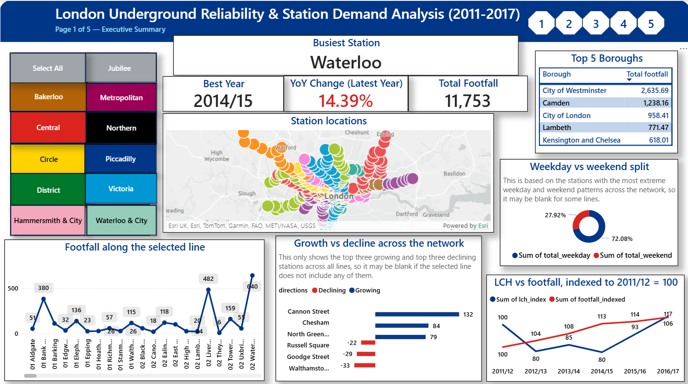

This is the landing page of the report. It is designed to answer the question "what do I need to know in the first ten seconds" before anyone digs deeper.

**Busiest Station card**
A simple headline card showing Waterloo as the busiest station across the whole period. This sets the scene for the rest of the report, since Waterloo reappears throughout as the network's biggest pressure point.

**Best Year, YoY Change and Total Footfall cards**
Three small cards sitting together. Best Year shows 2014/15 as the year with the strongest reliability performance. YoY Change shows a 14.39 per cent movement in the latest year, coloured red to flag that this is a negative development rather than good news. Total Footfall gives the overall scale of the numbers being discussed.

**Top 5 Boroughs table**
A ranked table of the five boroughs with the highest total footfall. City of Westminster sits well ahead of the rest, followed by Camden, City of London, Lambeth and Kensington and Chelsea. This tells the story of where London's Underground demand is physically concentrated, largely in central London.

**Station locations map**
An Esri powered map plotting every station as a bubble, coloured by line and sized by footfall. This gives an immediate visual sense of where the busiest parts of the network sit geographically, with the largest bubbles clustered around central London.

**Footfall along the selected line chart**
A line chart running along the bottom left of the page, showing footfall station by station along whichever line is selected in the slicer. This chart updates dynamically, so selecting Circle line or Piccadilly line, for example, reshapes the entire chart to that line's stations in order.

**Growth versus decline across the network**
A horizontal bar chart showing the three fastest growing and three fastest declining stations across the whole network, regardless of which line is selected. Cannon Street and Chesham lead the growth side, while Russell Square, Goodge Street and Walthamstow show the steepest declines. A note on the chart explains that this view only ever shows the network wide top three in each direction, so it may appear empty if a line's own stations do not make that list.

**Weekday versus weekend split donut**
A donut chart comparing weekday and weekend footfall, drawn from the stations with the most extreme patterns in each direction. It shows a 72.08 per cent weekday share against a 27.92 per cent weekend share, underlining how commuter driven the network remains.

**LCH versus footfall indexed chart**
A dual line chart indexing both Lost Customer Hours and footfall back to 100 in 2011/12, so the two trends can be compared on the same scale regardless of their different units. The chart shows footfall (red) climbing steadily to 117 by 2016/17, while the reliability index (blue) dips in the middle years before spiking back up. This chart is effectively a preview of the report's central argument, which is explored fully on page five.

**Page outcome**: this page tells the reader that footfall is growing, that it is concentrated in central London, that reliability has recently worsened, and that Waterloo is the single most important station to watch.

---

## Page 2: Reliability Trend

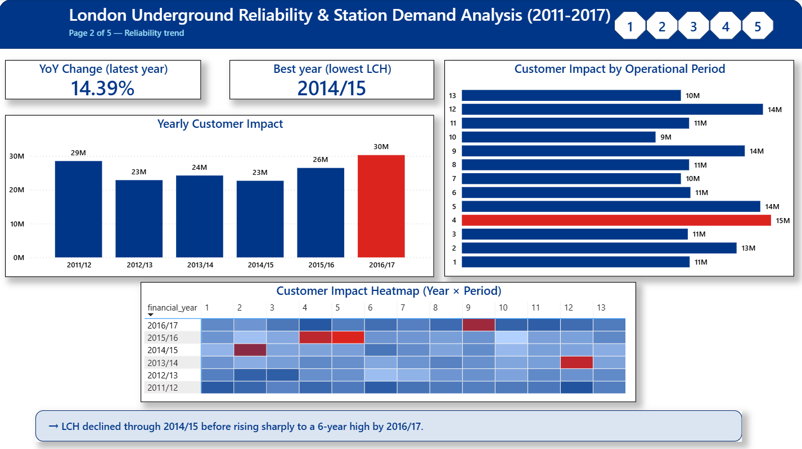

This page moves away from footfall and focuses entirely on reliability, measured in Lost Customer Hours, often shortened to LCH. Lost Customer Hours is a standard industry measure of the cumulative delay experienced by passengers across the network, so a rising figure means passengers are losing more time to disruption.

**YoY Change and Best year cards**
The same YoY Change figure from page one, 14.39 per cent, sits here alongside a Best year card confirming 2014/15 as the year with the lowest Lost Customer Hours, meaning it was the most reliable year in the data set.

**Customer Impact by Operational Period bar chart**
Transport for London divides its financial year into thirteen four week operational periods rather than calendar months. This chart shows total customer impact, in millions of hours, for each of the thirteen periods, added together across all years in the data set. Period four stands out clearly in red as the worst performing period overall, at 15 million hours, with periods five, nine and twelve also running high. This points towards a seasonal pattern worth investigating further, since certain periods consistently perform worse than others.

**Yearly Customer Impact bar chart**
A straightforward year on year bar chart of total Lost Customer Hours. The chart tells a clear story: impact fell from 29 million hours in 2011/12 down to a low of 23 million hours in both 2012/13 and 2014/15, before climbing again to 26 million in 2015/16 and then jumping sharply to 30 million in 2016/17, which is highlighted in red as the worst year in the whole six year period.

**Customer Impact Heatmap**
A matrix chart with years running down the side and the thirteen operational periods running across the top, shaded from light blue for low impact through to dark red for high impact. This lets a reader spot patterns that a simple bar chart would hide, for example the way period four shows up as consistently troublesome across several years, or the way 2016/17 has more red and dark blue cells overall than any other year.

**Summary callout box**
A plain English sentence at the foot of the page stating that Lost Customer Hours declined through to 2014/15 before rising sharply to a six year high by 2016/17. This kind of plain language callout is useful for anyone skimming the report quickly.

**Page outcome**: reliability improved steadily for three years, then reversed sharply in the final year of the data set, with certain operational periods, particularly period four, standing out as recurring weak points worth investigating.

---

## Page 3: Station Demand

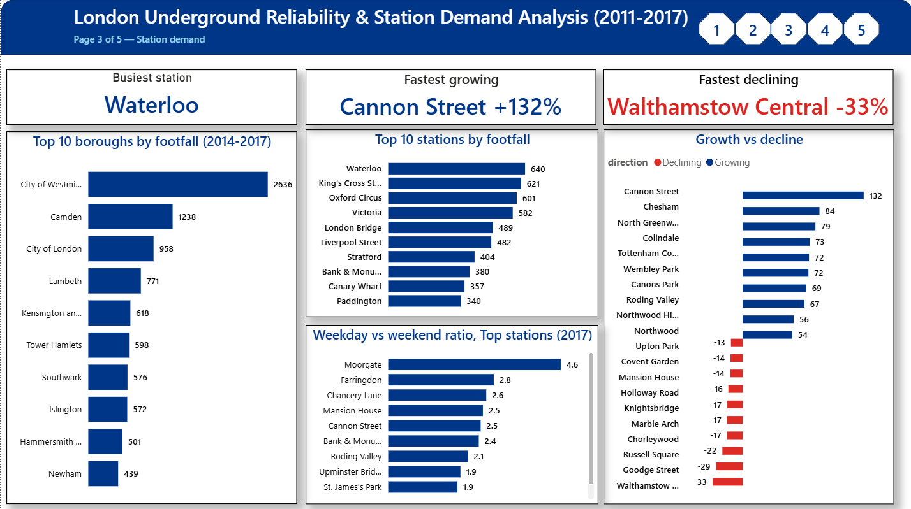

This page shifts the focus onto individual stations rather than the network as a whole, and covers the period from 2014 to 2017 specifically.

**Busiest station, Fastest growing and Fastest declining cards**
Three headline cards confirming Waterloo as busiest overall, Cannon Street as fastest growing at plus 132 per cent, and Walthamstow Central as fastest declining at minus 33 per cent. These numbers put real scale on the growth and decline story first introduced on page one.

**Top 10 boroughs by footfall bar chart**
A ranked bar chart repeating and expanding the borough table from page one, now showing all ten highest ranking boroughs rather than five. City of Westminster remains far ahead at 2,636, roughly double the next borough, Camden at 1,238.

**Top 10 stations by footfall bar chart**
A ranked bar chart of the busiest individual stations. Waterloo leads at 640, followed by King's Cross St Pancras at 621, Oxford Circus at 601, Victoria at 582 and London Bridge at 489, before Liverpool Street, Stratford, Bank and Monument, Canary Wharf and Paddington complete the list. This confirms that the busiest stations are almost all major interchange or terminus stations.

**Growth versus decline bar chart**
An expanded version of the chart from page one, this time showing the top ten growing and top ten declining stations rather than just the top three in each direction. On the growth side, Cannon Street's 132 per cent stands well clear of the next fastest growers, Chesham at 84 per cent and North Greenwich at 79 per cent. On the decline side, Walthamstow Central's minus 33 per cent leads a cluster of stations including Goodge Street, Russell Square and Knightsbridge all showing double digit percentage declines.

**Weekday versus weekend ratio bar chart**
This chart ranks the top stations of 2017 by how many times higher their weekday footfall is compared with weekend footfall. Moorgate tops the list with a ratio of 4.6, meaning it sees more than four and a half times as many passengers on an average weekday as on an average weekend day. Farringdon, Chancery Lane and Mansion House follow closely behind. This is a strong visual proof that London's most commuter focused stations are heavily skewed towards office worker travel patterns, in contrast with stations like Upminster Bridge and St James's Park which show much closer ratios nearer to two.

**Page outcome**: the busiest stations are dominated by central interchange hubs, growth and decline are both heavily concentrated in a small number of stations rather than spread evenly, and commuter stations show dramatically different weekday and weekend patterns compared with more leisure or residential focused stations.

---

## Page 4: Station Map

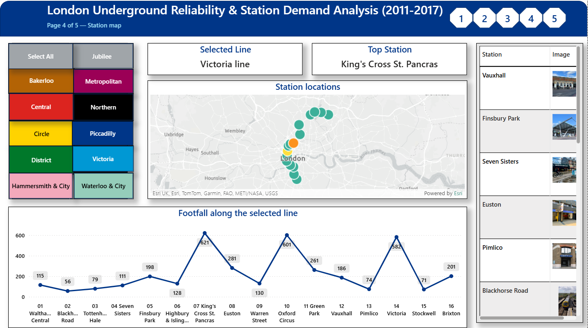

This page returns to the map view first seen on page one, but gives it much more room and pairs it with a station image gallery, allowing for genuine line by line exploration.

**Selected Line and Top Station cards**
Two cards confirming which line is currently selected in the slicer, in this example the Jubilee line, and which station on that line has the highest footfall, in this example Waterloo.

**Station locations map**
A larger version of the Esri map, now filtered to show only the stations on the selected line, coloured to match that line's official colour and sized according to footfall. Selecting a different line in the slicer instantly reshapes this map to that line's own route and stations.

**Footfall along the selected line chart**
A detailed line chart plotting every station on the selected line in geographic order from one end of the line to the other, with footfall values labelled directly on the chart. In the Jubilee line example shown, footfall climbs gradually from the outer stations, spikes dramatically at Waterloo with 640, dips at Southwark, spikes again at London Bridge with 489, and continues in a similar rolling pattern towards Stratford, Canning Town and the eastern end of the line. This shape, sometimes called a demand profile, is one of the more useful pieces of analysis in the whole report, since it shows planners exactly where along a line the pressure points sit.

**Station image gallery**
A scrollable table down the right hand side pairing each station name with a photograph, giving the report a more polished and tangible feel rather than being purely numbers on a page. This is a nice touch for anyone unfamiliar with the network, since it puts a real face to each station name.

**Page outcome**: this page turns the report from a set of statistics into a genuine planning tool, letting anyone explore any single line in detail and see exactly where footfall rises and falls along its length.

---

## Page 5: Cross Analysis and Recommendations

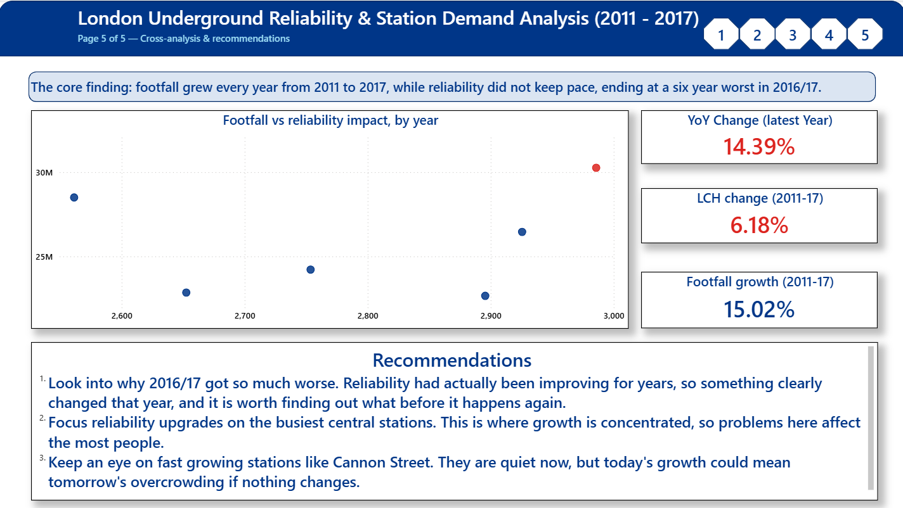

The final page is where the two separate stories from earlier in the report, footfall growth and reliability performance, are brought together directly, followed by clear, actionable recommendations.

**Core finding callout box**
A plain English statement at the top of the page setting out the headline conclusion of the whole report: footfall grew every year from 2011 to 2017, while reliability did not keep pace, ending at a six year worst in 2016/17.

**Footfall versus reliability impact scatter chart**
A scatter chart with footfall on the horizontal axis and Lost Customer Hours on the vertical axis, one dot per year. The final year, 2016/17, is highlighted in red and sits clearly apart from the rest of the group, in the top right corner of the chart, showing the highest footfall and the highest reliability impact recorded across the whole period. This single chart is the visual proof behind the report's core finding, since it shows demand and disruption rising together in the most recent year rather than moving independently.

**YoY Change, LCH change and Footfall growth cards**
Three summary cards giving the overall scale of change across the full six year period. Reliability impact rose by 6.18 per cent, while footfall grew by 15.02 per cent, a rate more than double the reliability figure. This confirms that growth in demand has consistently outpaced any improvement in reliability.

**Recommendations panel**
A written box setting out three practical recommendations arising from the analysis.

1. Investigate why 2016/17 performed so much worse than previous years, since reliability had been improving steadily beforehand, meaning something specific changed that year and is worth identifying before it happens again.
2. Focus reliability upgrades on the busiest central stations, since this is where growth is most concentrated and where any disruption affects the largest number of people.
3. Keep a close eye on fast growing stations such as Cannon Street, since a station that is quiet today could become tomorrow's overcrowding problem if current growth trends continue unchecked.

**Page outcome**: this page proves, with evidence rather than assumption, that footfall growth and reliability decline are connected, and closes the report with clear next steps that a real transport team could act on.

---

## Skills this project demonstrates

* Data modelling and relationship building in Power BI, combining separate footfall and reliability data sets into a single coherent model
* DAX measure writing for year on year change, indexing, ranking and growth versus decline calculations
* Use of Esri mapping within Power BI for geospatial visualisation
* Report design principles, including consistent page layout, a clear navigation system, and a deliberate narrative arc running from summary through to detailed findings and finally recommendations
* Translating raw statistics into plain English findings and genuinely actionable recommendations, a skill that matters as much to employers as the technical build itself

## About me

I built this report as part of my own practice in data analysis and business intelligence, with a particular interest in transport and public sector data. I am currently looking for opportunities in London within data analysis, business intelligence or transport planning roles, and I would welcome the chance to talk through this project, the choices behind it, or any part of the underlying data model.

Feel free to open the .pbix file yourself, explore the slicers, and reach out with any questions or feedback.

---

## Key Findings

- Footfall grew every single year from 2011 to 2017
- Lost Customer Hours actually improved for several years, 2012 to 2015, before reversing sharply
- 2016/17 was a six year worst for reliability, even though 2014/15 had been the best year on record
- Waterloo is the busiest station overall, while Cannon Street is the fastest growing and Walthamstow Central the fastest declining
- City of London financial district stations, led by Moorgate, show the sharpest weekday versus weekend contrast
- The relationship between demand and reliability is not simple or linear, worse outcomes are not inevitable just because footfall grows

---

## Recommendations

1. Look into why 2016/17 got so much worse. Reliability had actually been improving for years, so something clearly changed that year, and it is worth finding out what before it happens again.
2. Focus reliability upgrades on the busiest central stations. This is where growth is concentrated, so problems here affect the most people.
3. Keep an eye on fast growing stations like Cannon Street. They are quiet now, but today's growth could mean tomorrow's overcrowding if nothing changes.

---

## A Note on Data and Images

All reliability and footfall data comes from Transport for London, released under the Open Government Licence. Station coordinates were sourced from a Transport for London Freedom of Information response, released with no copyright restrictions. Station photographs are sourced from Wikipedia and Wikimedia Commons, mostly under Creative Commons licences that require attribution to the original photographer, so please check the individual file page for the correct photographer credit before using any image publicly.

---

## What Could Be Added With More Time

- Full, verified sequence order for every line, rather than a geographic approximation for lines that branch
- A more complete set of station photographs with individually confirmed licences
- Further recommendations tying station level reliability data to demand, if that data becomes available at station level in future

---

## Acknowledgements

All data is sourced from Transport for London under the Open Government Licence, with supporting open data used for station coordinates and line information. All analysis, cleaning and visualisation work is my own.
